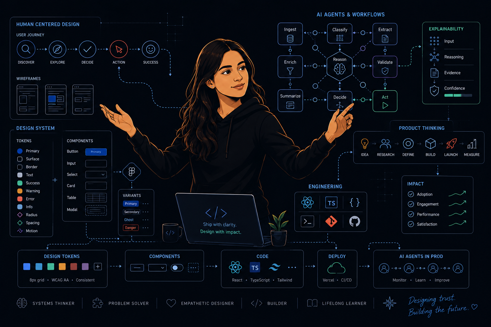

# Anupama Tiwari

**10+ years designing products. Now I design how AI agents think.**

---

### About Me

- Product designer and UX engineer working on **human-AI systems** — the layer where autonomous software meets human judgment. I design the contract between people and AI agents: what the agent may do, how it proves what it did, and where the human stays in control — then I build it in production-grade React/TypeScript.
- **Crossed from design into engineering** at CELUS (enterprise hardware-engineering SaaS, 1.5M+ components, clients incl. Siemens & NXP): shipped components through the same merge-request review, tests, and Storybook process as the frontend team, and architected the token system that cut UI inconsistency tickets by ~60%.
- **MIT xPRO — Designing & Building AI Products**: Exemplary Assignment Award (scored 100%) for SignalOS, a city-scale human-in-the-loop traffic AI.
- Background across enterprise SaaS, healthcare product design, and design systems.

---

### Featured Work

#### 🔍 DC Drift — AI agent for design–code verification

An agent that detects drift between approved Figma designs and shipped code — Claude Code + Figma MCP, governed by a versioned `rules.md`. Deterministic Drift Score with release gates, confidence thresholds routing uncertain findings to human review, and three role-specific reports from one findings set. Ships **real run reports**, including an honest 0/100 baseline where the agent correctly reported a missing screen instead of hallucinating a comparison.

#### 🕸 Nexus — AI-assisted investigation workbench

A frontend for AML-style investigation workflows: case inbox with regulatory deadlines, React Flow entity graphs, 360° profiles, and a streaming AI panel whose claims **cite transaction IDs** — with every analyst decision (agree / disagree / needs info) captured into the case record. Intentionally messy data, because investigation tools live on imperfect inputs. Keyboard-operable, screen-reader announced, `prefers-reduced-motion` respected.

#### 🎨 Foundry — open-source design-token engine

One accent color in → a complete accessible token system out: 10 families × 11 shades, WCAG validation with suggested fixes, semantic mapping, light/dark themes — exported as CSS variables, Tailwind config, `tokens.json`, and Figma variables. Framework-free TypeScript core with **100+ unit tests**, so one engine can power a web app, a Figma plugin, or a CLI.

---

### Skill Set

**AI & Agents**

**Frontend**

**Design**

---

### How I Work

- **Transparent beats impressive** — building my first agent taught me that evidence-linked, deterministic findings earn action, while fluent black-box verdicts don't. That insight now shapes everything I ship.
- **The human commits** — AI compresses the work before a decision; the decision, and its audit trail, stays human. I call the interaction enforcing this the *accountability handshake*.
- **Publish the limitations** — every project ships an honest "what breaks in production" section.
- **Ship through process** — merge requests, tests, and docs; design credibility is earned in the pipeline.

---

### Certifications

- 🏆 **MIT xPRO — Designing & Building AI Products** · Exemplary Assignment Award · 100%
- CELUS Future Leaders Program (2024) · Shift Nudge Interface Design (2025) · Google UX Design Certificate (2023)
